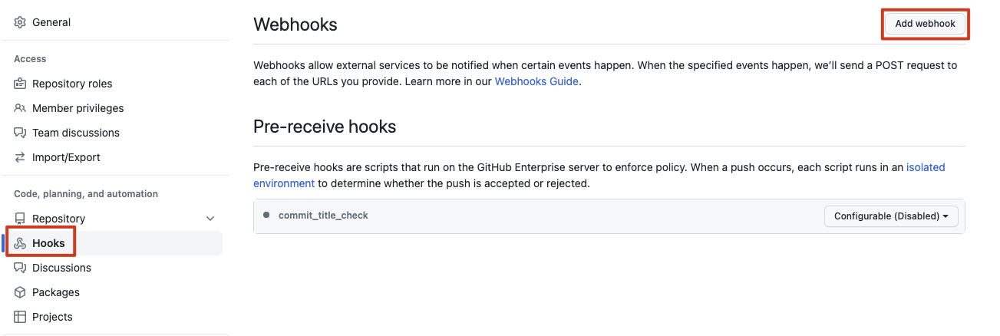

# 如何使用 github webhooks 触发安全扫描

## 思路

配置 github organization webhook，通过绑定 Folks 和 Pushes 事件触发安全扫描

在 organization settings 添加 webhook

webhook 绑定对应的事件，调用自己的 api 接口

## 方案

开发一个 webhook api 接口，接收 github webhooks 调用
从 webhook 调用传递过来的 payload 获取到对应的 repo 等信息
调用安全提供的扫描接口，将扫描有问题的结果发送给对应的 owner
